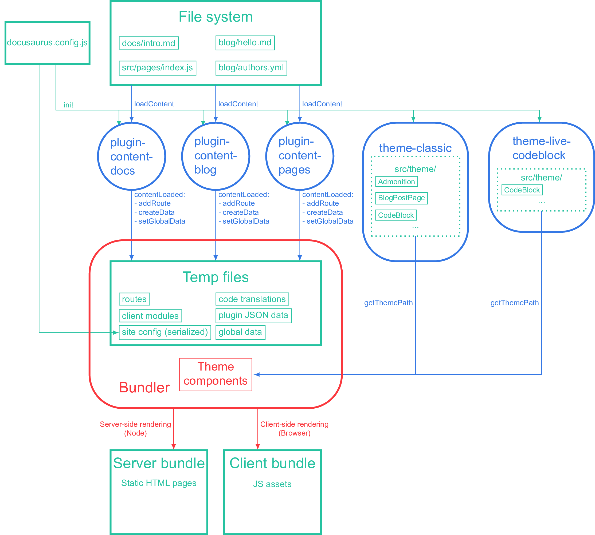

## Recent Posts

이 블로그 메인페이지에 recent post 기능을 추가하려고 대충 파일시스템으로 읽은다음  
메인페이지에 보여주려고 했더니 은근 까다롭게 굴길레 문서를 정독한 결과  
plugin만들어 쓰기로 결정했고 blog 관련 plugin이 있긴했지만 [plugin-content-blog](https://docusaurus.io/docs/api/plugins/@docusaurus/plugin-content-blog)  
config의 blog필드를 이용하고 내가 원하는 모양이 아니여서 패스함

## 주의할 점

docusaurus plugin은 코드를 직접 import해서 쓰거나 하지않고  
json으로 임시파일을 만들어 데이터를 주고받거나 사용자가 plugin에 접근한다면  
오로지 config.js를 통해 상호작용 할 수 있도록 설계되어 있기때문에  
여기서 제공하는 Lifecycle API를 이용해 build시 생성된 json 파일로  
내 블로그 데이터에 접근해야 한다. 따라서 대부분의 커스텀은 config에서 가능함



그래서 문서를 찾아보던중 globalData를 사용할 수 있는 `useGlobalData` API가  
있긴했으나 docs의 정보만 담아줄 뿐 blog의 데이터는 담기지 않길래 Lifecycle API를 이용해  
build시 json에 블로그 정보들을 담아 사용하는 쪽으로 변경했다.  
globalData의 정보들은 `npm start`시 `.docusaurus/globalData.json`에서 확인가능

- [useGlobalData](https://docusaurus.io/docs/docusaurus-core#useGlobalData)

## Using Plugins

plugin은 명령어를 통해 설치할 수도 있지만 로컬파일을 불러와 사용가능함

```ts title="docusaurus.config.js"
export default {
  // ...
  plugins: ['./src/plugins/docusaurus-local-plugin'],
};
```

로컬파일을 불러와 사용하는 경우 절대경로로 명시한다.

```ts title="docusaurus.config.js"
export default {
  // ...
  plugins: [
    async function myPlugin(context, options) {
      // ...
      return {
        name: 'my-plugin',
        async loadContent() {
          // ...
        },
        async contentLoaded({ content, actions }) {
          // ...
        },
        /* other lifecycle API */
      };
    },
  ],
};
```

직접 함수를 작성하는 방법도 가능

위와같이 경로를 지정했다면 Docusaurus측에서 제공하는 Lifecycle APIs를  
이용해 코드를 작성하면 된다.

- [Lifecycle APIs](https://docusaurus.io/docs/api/plugin-methods/lifecycle-apis)

API들중 가장 중요하다고 볼 수 있는 `async loadContent()`와  
`async contentLoaded({content, actions})` 두 가지가 있는데 `loadContent`에서 파일시스템에  
접근하거나 다양한 동작들이 가능한데 `loadContent`에서 내가 필요한 값을 return한다면  
그 값은`contentLoaded`함수에서 `content` 파라미터로 받는다. `actions`의 경우  
기본으로 제공하는 3가지 함수들이 있고 경로를 설정하는 경우 `appRoute`  
json파일을 만든다면 `createData` 나의 경우 기존 globalData.json에 데이터를
추가하려고 했기에 마지막인 `setGlobalData`를 사용했다.

```ts title="./src/plugins/my-plugin.js"
export default {
  plugins: [
    async function myPlugin(context, options) {
      return {
        name: 'my-plugin',
        async loadContent() {
          return 1;
        },

        // loadContent의 return값 content에 전달
        async contentLoaded({ content, actions }) {
          const { setGlobalData } = actions;
          setGlobalData({ myBlogData: content });
        },
      };
    },
  ],
};
```

위처럼 코드를 작성하면 `npm start`시 globalData에 데이터가 저장되고  
내가 원하는 부분에서 사용하려면 `useGlobalData` 및 `usePluginData`를 사용해  
데이터를 가져와 사용하면 끝

```tsx title="./src/pages/index.tsx"
import { usePluginData } from '@docusaurus/useGlobalData';

export default function Home() {
  const { myBlogData } = usePluginData('my-plugin');

  return (
    <ul className="post-list-container">
      {myBlogData?.map((post) => (
        <li key={post.slug}>
          <Link to={`/blog/${post.slug}`}>{post.title}</Link>
          {post.date}
        </li>
      ))}
    </ul>
  );
}
```
