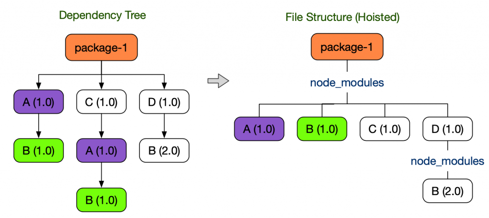

얼마전 토스과제를 진행하며 알게된 점들은 매끄러운 사용자경험을 위해 frontend 로직뿐 아니라  
보이지 않는 환경설정에도 엄청난 노력을 하고있음을 알게되었다. 이전에 개발을 하며  
알고는 있지만 자세하게 몰랐던 부분과 그들의 디테일에 놀라워하며 면접준비를 했는데  
이 글에서는 이 과정에서 알게된 사실들을 정리한다.

:::important 참고
Youtube 및 toss tech blog를 참고하여 작성한 글 입니다.
:::

## dependencies in Package.json

우리가 개발을하며 패키지매니저를 통해 라이브러리를 설치할 때는
`package.json` 내의 `dependencies` 필드를 통해 의존성을 규정하는것으로 설치한다
이때 해당 패키지의 이름과 버전범위를 지정한 객체를 통해 설치하는데
버전의 범위는 하나 혹은 여러개의 공백으로 분리된 문자열이다.  
버전범위를 지정하는 자세한 방법은 [semver](https://docs.npmjs.com/misc/semver)를 참고

만약 개발중에만 필요한 라이브러리일 경우 `devDependencies`필드를 활용하며

```bash
npm install some-package --save-dev
```

위와 같은 명령어로 설치 가능하고 패키지를 설치 후 `devDependencies`에 추가한다.  
여기서 만약 내가 clone된 repository에서 `npm install`했을 경우 npm은 이를 프로젝트를  
개발중이라고 인식하고 `devDependencies`에 추가하니 유의할 것.

마지막으로 본인만의 plugin을 만들 때 사용하는 `peerDependencies`인데  
정의에 따르면 상속되는 의존성으로 패키지를 사용하는 곳에서 제공해야하는 의존성이다.  
만약 프로젝트 내에서 패키지를 `peerDependencies`로 명시할 경우 패키지를 제공하는 책임을  
가장 상위프로젝트로 바꾸기 때문에 번들링 결과에서 중복을 막을 수 있다.

하지만 이러한 장점에도 치명적인 단점은 의존성 전파문제이다.

```json
package A:
    peerDependencies:
            "package P"
package B:
        dependencies:
            "package A"
    peerDependencies:
            "package P"
package C
        dependencies:
            "package B"
    peerDependencies:
            "package P"
```

위와 같이 peerDependency를 사용하는 `package A`에서 A를 가지고 있는 모든 패키지들은
A를 사용하지 않음에도 peerDependencies에 추가해주어야 하며 이는 의존성의 관리복잡도를 증가시켜  
에러의 확률을 높인다 npm과 같은 패키지매니저들에서 이러한 오류들을 엄밀히 검사하지 않기 때문에
유의해야 하며 따라서 `peerDependencies`를 사용하는 경우  
단 하나의 패키지만 존재해야 하는경우(싱글톤) 일때 사용할 수 있다.

### dependencies의 문제점

위와 같은 문제말고도 `npm/node_modules`의 문제는 **유령의존성(Phantom Dependency)** 현상이다  
node_modules를 사용하는 yarn v1 및 npm에서는 중복해서 설치하는 모듈을 피하기 위해  
호이스팅 기법을 사용한다



왼쪽과 같은 의존성트리일 경우 디스크공간의 절약을 위해 중복되는 트리를 지우는 과정에서  
직접 의존하고 있지 않았던 `B(1.0)` 패키지를 불러와 사용할 수 있다.  
package.json 에 명시하지 않은 라이브러리를 사용할 수 있는 현상을 Phantom Dependency라고 하며  
이러한 특성은 시스템을 혼란스럽게 하고 최악의 경우 Runtime Error의 가능성을 높힌다.

토스팀에서는 이러한 문제를 해결하기 위해 `Yarn Berry + PnP`를 도입하며 해결했다.  
Yarn Berry는 `Plug'n'Play` 전략을 이용하여 기존의 Package.json을 기반으로 의존성 트리를  
만들어 node_modules 구조를 생성하던 방식에서 의존성 설치시 node_modules를 생성하지 않고  
`.yarn/cache`폴더에 의존성 정보를 저장한다 또한 `.pnp.cjs` 파일에 의존성을 찾을 수 있는  
정보를 기록하여 효율적인 패키지 관리를 할 수 있다.

yarn은 기존 node.js의 `require`함수를 덮어씌워 동작하며 효율적인 패키지관리를  
할 수 있고 이때문에 특정 패키지와 의존성에 대한 정보가 필요할 때 바로 알 수 있다  
또한 Yarn PnP 시스템에서 각 의존성은 Zip 아카이브로 관리하게 되어 다음과 같은 장점이 생긴다

1. node_modules가 없음 -> 빠른 설치 가능
2. 패키지들은 하나의 Zip아카이브로 저장하여 중복방지
3. 파일의 수가 적어지며 변경사항의 감지가 쉬워지고 삭제가 빠르다.

### Zero Install

여기서 한발 더 나아가 의존성을 Git으로 관리한다면 어떨까?  
일반적인 node_modules의 크기는 1.2GB/13만5천개의 파일을 가지고 있지만 yarn을 사용한다면  
139MB/2천개의 압축파일로 줄어든다 이렇게 줄어든 파일크기는 Git으로 관리하여 버전관리에  
포함시키고 설치할게 아예없는 환경을 구성한다.(Zero-Install)

토스팀에서 Zero-Install을 사용하며 얻은 장점 두 가지

1. clone 혹은 branch변경시 yarn install 실행x

   - 만약 다른 의존성을 사용하는 브랜치로 이동한다면 재설치할 필요가 없다.

2. CI동작시 의존성 설치시간 절약

   - cache miss 일경우 60 ~ 90초 가량 소요되던 시간을 의존성 복제만으로  
     바로 사용이 가능하여 시간절약

## Transplier/Bundler

## 참고

- [package.json 번역](https://programmingsummaries.tistory.com/385)
- [node_modules로부터 우리를 구원해 줄 Yarn Berry](https://toss.tech/article/node-modules-and-yarn-berry)
- [FECONF 2022 [B4] 내 import 문이 그렇게 이상했나요?](https://www.youtube.com/watch?v=mee1QbvaO10&t=325s)
- [FECONF 2022 [B2] 일백개 패키지 모노레포 우아하게 운영하기](https://www.youtube.com/watch?v=Ix9gxqKOatY&t=114s)
- [FEConf 2023 [B4] React Native, Metro를 넘어서](https://www.youtube.com/watch?v=QfU5REp8sjQ&t=1253s)
- [토스ㅣSLASH 22 - 잃어버린 개발자의 시간을 찾아서: 매일 하루를 아끼는 DevOps 이야기](https://www.youtube.com/watch?v=2IE68SDTYvI&list=PL1DJtS1Hv1PiGXmgruP1_gM2TSvQiOsFL&index=32)
- [토스ㅣSLASH 22 - 잃어버린 유저의 시간을 찾아서 : 100년을 아껴준 SSR 이야기](https://www.youtube.com/watch?v=IKyA8BKxpXc)
- [JavaScript 번들러의 이해](https://medium.com/naver-place-dev/javascript-%EB%B2%88%EB%93%A4%EB%9F%AC%EC%9D%98-%EC%9D%B4%ED%95%B4-1-javascript-%EB%AA%A8%EB%93%88-d68c7e438fcd)
- [Git 내부 동작 파헤치기](https://tech.wonderwall.kr/articles/git/)
